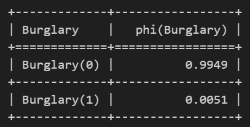
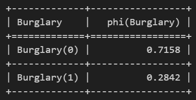

<H3> Name : Kavinraja D </H3>
<H3> Register No :212222240047 </H3>
<H3> Experiment : 2 </H3>
<H3> Date : </H3>
<h1 align =center>Implementation of Exact Inference Method of Bayesian Network</h1>

## Aim:

To implement the inference Burglary P(B| j,⥗m) in alarm problem by using Variable Elimination method in Python.

## Algorithm:

### Step 1: 

Define the Bayesian Network structure for alarm problem with 5 random variables, Burglary,Earthquake,John Call,Mary Call and Alarm.<br>

### Step 2:

Define the Conditional Probability Distributions (CPDs) for each variable using the TabularCPD class from the pgmpy library.<br>

### Step 3: 

Add the CPDs to the network.<br>

### Step 4: 

Initialize the inference engine using the VariableElimination class from the pgmpy library.<br>

### Step 5: 

Define the evidence (observed variables) and query variables.<br>

### Step 6: 

Perform exact inference using the defined evidence and query variables.<br>

### Step 7: 

Print the results.<br>

## Program:

```python

# Importing Library:

from pgmpy.models import BayesianNetwork
from pgmpy.inference import VariableElimination

!pip install pgmpy

# Importing Library:

from pgmpy.models import BayesianNetwork
from pgmpy.inference import VariableElimination

# Defining network structure:

alarm_model = BayesianNetwork(
    [
        ("Burglary", "Alarm"),
        ("Earthquake", "Alarm"),
        ("Alarm", "JohnCalls"),
        ("Alarm", "MaryCalls"),
    ]
)

# Defining the parameters using CPT:

from pgmpy.factors.discrete import TabularCPD

cpd_burglary = TabularCPD(
    variable="Burglary", variable_card=2, values=[[0.999], [0.001]]
)
cpd_earthquake = TabularCPD(
    variable="Earthquake", variable_card=2, values=[[0.998], [0.002]]
)
cpd_alarm = TabularCPD(
    variable="Alarm",
    variable_card=2,
    values=[[0.999, 0.71, 0.06, 0.05], [0.001, 0.29, 0.94, 0.95]],
    evidence=["Burglary", "Earthquake"],
    evidence_card=[2, 2],
)
cpd_johncalls = TabularCPD(
    variable="JohnCalls",
    variable_card=2,
    values=[[0.95, 0.1], [0.05, 0.9]],
    evidence=["Alarm"],
    evidence_card=[2],
)
cpd_marycalls = TabularCPD(
    variable="MaryCalls",
    variable_card=2,
    values=[[0.99, 0.3], [0.01, 0.7]],
    evidence=["Alarm"],
    evidence_card=[2],
)

# Associating the parameters with the model structure:

alarm_model.add_cpds(
    cpd_burglary, cpd_earthquake, cpd_alarm, cpd_johncalls, cpd_marycalls
)

alarm_model.check_model()

inference=VariableElimination(alarm_model)

evidence={"JohnCalls":1,"MaryCalls":0}

query='Burglary'

res=inference.query(variables=[query],evidence=evidence)

print(res)

evidence2={"JohnCalls":1,"MaryCalls":1}

res2=inference.query(variables=[query],evidence=evidence2)

print(res2)

```

## Output :

### Inference 1:



### Inference 2:



## Result :

Thus, Bayesian Inference was successfully determined using Variable Elimination Method.

